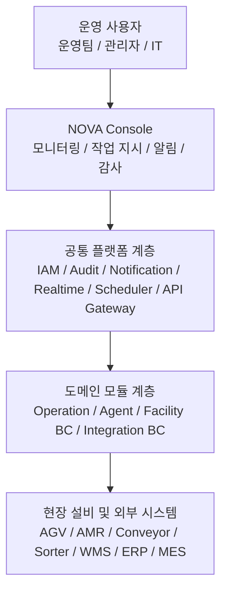
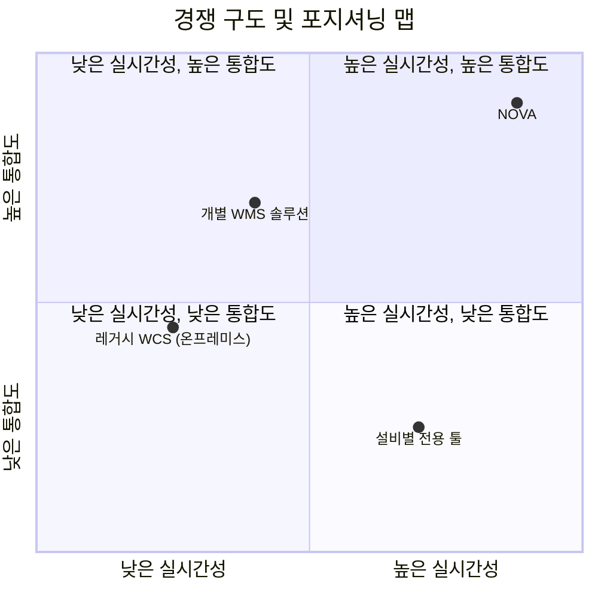

# NOVA 제품 스토리텔링 문서

> 목적: 카피 작성, 세일즈 자료, UI 문구 수정 시 일관된 메시지 기준으로 사용한다. 랜딩페이지, 발표자료, 제안서는 모두 이 문서에서 출발한다.

---

## 0. 문서 사용 원칙

- 이 문서는 "무엇을 말할지"보다 "어떤 순서로 설득할지"를 정리한 기준 문서다.
- 모든 메시지는 `문제 -> 원인 -> 결과 -> NOVA의 해결 -> 증명` 흐름을 따른다.
- 추상적 표현보다 운영 맥락, 시스템 구조, 검증 가능한 근거를 우선한다.
- 랜딩페이지, 세일즈 자료, UI 카피는 이 문서의 표현을 그대로 재사용하거나 축약해 사용한다.

---

## 1. 제품 정의

### 브랜드명
**NOVA** — Idenflu의 물류 운영 플랫폼 브랜드

### 한 줄 포지셔닝
> 물류 운영의 핵심 계층인 설비 모니터링, 작업 지시, 알림, 보안, 스케줄링을 표준화된 플랫폼으로 통합한 WES/WCS 솔루션

### 엘리베이터 피치
레거시 물류 현장은 설비 모니터링, 작업 지시, 알림, 감사가 각각 다른 시스템에 흩어져 있다. 그 결과 장애 인지는 늦고, 의사결정은 보고서에 의존하며, 감사 준비에는 며칠이 걸린다.

NOVA는 이 파편화된 구조를 표준화된 플랫폼으로 대체한다. 실시간 설비 모니터링부터 RBAC 기반 보안, 멀티채널 알림, 변경 감사, 작업 스케줄링까지 단일 계약과 단일 콘솔로 제공한다.

결과는 명확하다. 장애는 실시간으로 감지되고, 운영팀은 화면을 전환하지 않으며, 관리자는 감사 전날 로그를 수작업으로 모으지 않는다.

### 지금 필요한 이유

- **설비 밀도 증가**: AGV, AMR, 소터, 컨베이어가 동시에 운영되는 현장이 표준이 됐다. 설비별 개별 솔루션만으로는 통합 가시성을 확보할 수 없다.
- **컴플라이언스 압력 강화**: 변경 이력 추적과 접근 감사 요구가 강화되고 있다. 사후 취합 방식으로는 대응 한계가 명확하다.
- **클라우드 네이티브 전환 수요**: 온프레미스 단일 벤더 종속에서 벗어나 독립 모듈 단위로 확장 가능한 구조에 대한 수요가 커지고 있다.

### 자사 제품 특징

- **표준화된 플랫폼 기반 구현 및 운영**: 프로젝트마다 처음부터 다시 만드는 방식이 아니라, 검증된 공통 플랫폼 위에서 구현하고 운영한다. 도입 속도, 운영 일관성, 유지보수 효율을 함께 확보한다.
- **다양한 운영 규모와 복잡도에 대응하는 구성 유연성**: WES/WCS를 대규모 복합 설비 중심으로도, 상대적으로 단순한 운영 구조 중심으로도 구성할 수 있다. 현장의 설비 밀도와 운영 복잡도에 맞춰 필요한 범위만 선택해 적용할 수 있다.

### 플랫폼 아키텍처

NOVA는 공통 플랫폼 계층 위에 운영 모듈과 설비 연동 모듈을 분리해 쌓는 구조를 가진다. 이 구조는 공통 기능은 표준화하고, 설비별 특성과 현장별 요구는 독립 모듈로 수용할 수 있게 만든다.

#### 아키텍처 원칙

- **공통 기능 표준화**: 인증, 권한, 감사, 알림, 스케줄링, 실시간 스트림은 플랫폼 공통 계층에서 일관되게 제공한다.
- **도메인 모듈 분리**: Operation, Agent, 설비 BC, 연동 BC를 분리해 설비별 요구사항을 독립적으로 반영한다.
- **운영과 연동의 분리**: 사용자 경험을 담당하는 콘솔 계층과 실제 설비 연동 계층을 분리해 변경 영향을 최소화한다.
- **확장 중심 구조**: 새 설비나 새 센터를 추가할 때 기존 공통 플랫폼을 흔들지 않고 필요한 모듈만 확장한다.

---

## 2. 메시지 아키텍처

### 핵심 내러티브
> 레거시 환경의 문제는 단순한 불편이 아니라, 운영 지연과 비용 손실을 반복적으로 만드는 구조적 비효율이다. NOVA는 그 구조를 표준화된 플랫폼으로 재설계해 실시간성, 통합성, 확장성을 동시에 확보한다.

### 핵심 메시지 3가지

#### 1. 통합
**표준화된 플랫폼, 완전한 제어**

현장 운영에 필요한 엔터프라이즈 모듈(Operation, Agent, IAM, Audit, Notification, Realtime 등)이 표준화된 플랫폼 위에 통합돼 있다. 설비 모니터링부터 작업 지시, 알림 확인, 감사 이력 조회까지 단일 콘솔에서 처리한다.

**증명 포인트:** 통합 모듈(8+) / 단일 콘솔 / 단일 계약

#### 2. 안정성
**안정적인 운영, 데이터가 현장을 이끈다**

Snapshot-first Delta push 구조로 대시보드와 운영 화면을 지속 동기화한다. 운영 판단의 기준은 보고서가 아니라 이벤트 스트림이다. 장애는 발생 즉시 감지되고 알림은 자동으로 전달된다.

**증명 포인트:** 이벤트 기반 실시간 아키텍처 / WebSocket 실시간 스트림 / 멀티채널 자동 알림

#### 3. 확장성
**새 설비를 더해도 재개발 없이**

모듈러 아키텍처로 각 설비 BC(Bounded Context)가 독립적으로 진화한다. 새 설비나 새 센터를 추가할 때 기존 플랫폼을 크게 수정하지 않고 필요한 모듈만 연결할 수 있다.

**증명 포인트:** 독립 설비 BC / 기존 운영 무중단 / 수평 확장 가능 아키텍처

---

## 3. 핵심 문제 정의

> 레거시 환경의 고통은 "불편함"이 아니라 조용한 비용 누수다. 눈에 보이지 않기 때문에 더 위험하다.

### 현장의 6가지 고통

| # | 문제 | 현장에서 일어나는 일 | 조용한 비용 |
|---|---|---|---|
| 1 | **파편화된 시스템** | 장애 감지를 위해 모니터링 툴, 작업 지시 시스템, 알림 앱을 번갈아 열어야 한다 | 장애 인지 지연이 누적 처리량 손실로 이어진다 |
| 2 | **지연된 의사결정** | 어제의 보고서로 오늘의 병목을 판단한다 | 잘못된 판단 한 번이 라인 중단 수십 분으로 이어질 수 있다 |
| 3 | **보안·감사 공백** | "누가 이 설정을 바꿨나요?"에 즉시 답할 수 없다 | 감사 실패 리스크와 로그 수작업 취합 공수가 동시에 발생한다 |
| 4 | **예측 불가한 운영 비용** | 벤더별 모니터링, 알림, 작업 관리 계약이 계속 누적된다 | 라이선스, 커스터마이징, 유지보수 비용이 중첩된다 |
| 5 | **취약한 시스템 안정성** | AGV 연동 하나가 끊기면 전체 운영이 흔들린다 | 예기치 못한 다운타임이 출고 지연과 고객 클레임으로 이어진다 |
| 6 | **높은 확장 장벽** | 새 센터를 열거나 설비를 추가할 때마다 IT 재개발이 필요하다 | 확장 프로젝트마다 수개월의 일정과 큰 비용이 반복된다 |

---

## 4. 해결 서사

### Before NOVA / After NOVA

| 상황 | Before NOVA | After NOVA |
|---|---|---|
| 설비 장애 발생 | 담당자가 여러 시스템을 확인하고 수동 전화, 메시지로 재배분 지시를 내린다 | 실시간 스트림이 장애를 감지하고 멀티채널 알림과 자동 재배분이 이어진다 |
| 감사 준비 | 시스템별 로그를 수일간 수작업으로 취합하고 엑셀로 정리한다 | 기간과 대상을 설정해 감사 이력을 즉시 내보낸다 |
| 신규 설비 추가 | IT 재개발 프로젝트가 선행되고 기존 운영 영향 범위를 따져야 한다 | 독립 모듈을 추가해 기존 플랫폼과 바로 연동한다 |
| 피크 대응 | 물동량 급증을 늦게 인지하고 수동으로 재배분한다 | 임계치 초과를 자동 감지하고 유휴 설비로 즉시 분산한다 |
| 비용 관리 | 벤더별 청구서를 분기마다 취합해 뒤늦게 검토한다 | 표준화된 플랫폼과 단일 계약 구조로 비용 예측 가능성을 높인다 |

### 한 문장 요약
> NOVA는 운영팀이 여러 시스템을 오가며 뒤늦게 대응하던 구조를, 하나의 콘솔에서 실시간으로 감지하고 지시하고 추적하는 구조로 바꾼다.

---

## 5. 포지셔닝

### 경쟁 구도

### NOVA의 주요 차별화 포인트

아래 항목은 현재 문서에서 우선 정리한 비교 기준이며, 필요에 따라 추가 확장할 수 있다.

| 축 | 기존 솔루션 | NOVA |
|---|---|---|
| **통합 범위** | 기능별 개별 도입 | 모니터링, 작업, 알림, 보안, 스케줄링을 표준화된 플랫폼으로 통합 |
| **응답성** | 보고서 기반, 분 단위 또는 시간 단위 대응 | 실시간 이벤트 스트림 기반 대응 |
| **확장 방식** | 설비 추가 시 재개발 필요 | 독립 모듈 추가 중심의 확장 |

---

## 6. 페르소나별 메시지

### 1. 현장 운영팀

**역할:** 물류센터 운영, 설비 상태 모니터링, 작업 배분

**핵심 고통**
- 설비 장애 감지를 위해 여러 화면을 번갈아 확인한다
- 장애 발생 시 직접 전화나 메시지로 재배분 지시를 내려야 한다
- 피크 타임에는 놓치는 이벤트가 많아진다

**NOVA의 답변**
> 모든 설비 상태와 태스크 현황이 하나의 화면에 있다. 장애가 나면 NOVA가 먼저 감지하고, 필요한 알림과 재배분까지 자동으로 이어간다.

**증명 포인트**
- 2.5D 아이소메트릭 콘솔로 현장 전체를 한 화면에서 확인
- 실시간 이벤트 타임라인으로 장애 발생부터 조치 이력까지 추적
- 심각도 기준 알림 패널로 중요한 이슈에 우선 대응

### 2. IT · 시스템 관리자

**역할:** 플랫폼 구축과 운영, 보안 정책 관리, 설비 연동

**핵심 고통**
- 새 설비를 추가할 때마다 기존 시스템 영향 범위를 검토해야 한다
- 감사 시 접근 이력과 변경 이력을 어디서 꺼내야 할지 불분명하다
- 여러 벤더를 관리하면서 장애 책임 소재가 불명확해진다

**NOVA의 답변**
> 각 설비는 독립 모듈로 연결된다. 기존 운영을 멈추지 않고 확장할 수 있고, RBAC와 감사 로그는 플랫폼 기본 기능으로 제공된다.

**증명 포인트**
- 독립 설비 BC 구조로 기존 플랫폼 영향 최소화
- RBAC 기반 접근 제어와 변경 이력 자동 기록
- 모듈러 아키텍처로 단일 벤더 종속 완화

### 3. 물류 관리자 · 의사결정자

**역할:** 운영 비용 최적화, 리스크 관리, 경영 보고

**핵심 고통**
- 여러 솔루션의 라이선스와 유지보수 비용이 누적돼 TCO가 불투명하다
- 감사 대응 준비에 며칠이 걸린다
- 실시간 운영 데이터가 부족해 보고서 중심으로 의사결정한다

**NOVA의 답변**
> 표준화된 플랫폼과 단일 계약 구조로 비용 예측 가능성을 높인다. 감사 이력은 즉시 내보낼 수 있고, 실시간 KPI를 기반으로 더 빠르게 의사결정할 수 있다.

**증명 포인트**
- 벤더 통합으로 라이선스와 커스터마이징 구조 단순화
- 기간과 대상 기준 감사 이력 즉시 내보내기
- 장애 격리를 통한 무중단 고가용성 운영

---

## 7. 산업별 적용 포인트

### 1. 3PL · 물류센터

**핵심 맥락:** 여러 센터, 여러 고객사, 여러 설비를 동시에 운영하며 물동량 변동이 크다.

**NOVA가 유효한 이유**
- 센터별 운영 기준과 알림 체계를 분리해 관리할 수 있다
- 피크 타임 태스크 자동 재배분으로 처리량을 보호한다
- 멀티센터 설비 상태를 단일 콘솔에서 관제한다

**핵심 메시지:** 센터가 늘어도 콘솔은 하나

### 2. 제조 · 공장 물류

**핵심 맥락:** 생산 계획과 물류 작업 지시가 긴밀하게 연결되며 AGV, 컨베이어, 소터가 밀집 운영된다.

**NOVA가 유효한 이유**
- 생산 계획 변경이 물류 작업 지시에 빠르게 반영된다
- 다양한 설비를 독립 모듈로 통합 연동할 수 있다
- 설비 상태와 작업 지시를 같은 기준과 같은 화면에서 관리한다

**핵심 메시지:** 설비가 달라도 운영 기준은 하나

### 3. 이커머스 · 풀필먼트

**핵심 맥락:** 수요 변동 폭이 크고 피킹, 분류, 출고 흐름을 빠르게 조정해야 한다.

**NOVA가 유효한 이유**
- 주문 급증 시 작업 우선순위를 즉시 재조정할 수 있다
- 피킹, 분류, 출고 단계를 실시간으로 추적할 수 있다
- 대량 예외 알림과 재처리를 자동화할 수 있다

**핵심 메시지:** 주문이 급증해도 운영은 흔들리지 않는다

---

## 8. 브랜드 보이스와 카피 원칙

### 톤 정의
**신뢰할 수 있는 현장 파트너**

과장하지 않고 현장 언어로 말한다. 기술을 설명하되 기술 자체보다 운영 결과와 구조적 장점을 강조한다.

| 속성 | 설명 |
|---|---|
| **전문적** | 물류, WES/WCS 도메인 언어를 정확하게 사용한다 |
| **간결** | 한 문장에 하나의 메시지를 담는다 |
| **데이터 기반** | 주장에는 수치나 구조적 근거를 붙인다 |
| **현장 중심** | 기술 기능보다 운영 맥락과 결과를 먼저 말한다 |

### 피해야 할 표현

| 피해야 할 표현 | 이유 | 대안 |
|---|---|---|
| "혁신적인", "차세대" | 근거 없는 형용사다 | 구체적 기능이나 구조로 대체한다 |
| "~할 수 있습니다" | 가능성 중심의 약한 표현이다 | "~합니다"처럼 사실형 문장으로 쓴다 |
| "쉽게", "간편하게" | 주관적이고 검증이 어렵다 | 단계 수, 시간, 자동화 범위로 설명한다 |
| "모든" | 과장 표현으로 해석될 수 있다 | 실제 커버 범위를 명시한다 |
| "업계 최고", "No.1" | 근거 없이는 사용할 수 없다 | 검증 가능한 사실로 대체한다 |

### 선호 표현 패턴

- 문제 -> 원인 -> 결과 순으로 설명한다
- Before / After 대비를 적극적으로 사용한다
- "표준화", "안정성", "확장성"처럼 시스템의 본질적 가치를 중심으로 말한다
- "감지합니다", "재배분합니다", "추적합니다"처럼 행동 동사를 사용한다

### UI 문구 작성 가이드

- **오류 메시지**: 원인과 해결 방법을 함께 쓴다.  
  예시: `알 수 없는 오류가 발생했습니다` 대신 `설비(AGV-01) 응답이 없습니다. 전원 상태를 확인하세요`
- **정보 메시지**: 사용자가 이해해야 할 결과만 남긴다.  
  예시: `성공적으로 모든 설정 저장이 완료되었습니다` 대신 `설정을 저장했습니다`
- **버튼 문구**: 동작이 드러나는 동사형으로 쓴다.  
  예시: `확인 / 취소` 대신 `재배분하기 / 닫기`

---

## 9. 도입 프로세스 타임라인

NOVA 도입은 한 번에 전체를 바꾸는 방식이 아니라, 현장을 이해하고, 제한된 범위에서 먼저 검증한 뒤, 운영 중단 없이 확장하는 방식으로 진행한다. 핵심은 빠른 구축보다 예측 가능한 전환이다.

### 도입 원칙

- **현장 우선**: 실제 운영 흐름과 설비 상태를 먼저 파악한 뒤 범위를 확정한다.
- **작게 시작하고 빠르게 검증**: 파일럿 범위에서 먼저 효과와 리스크를 검증한다.
- **운영 중단 최소화**: 기존 운영을 유지한 채 단계적으로 연결하고 전환한다.
- **표준화된 플랫폼 기반 확장**: 검증된 구조를 바탕으로 센터와 설비를 반복 확장한다.

### 단계별 진행 방식

| 단계 | 기간 | 목표 | 주요 활동 | 고객이 얻게 되는 결과 |
|---|---|---|---|---|
| **01. 운영 구조 진단** | `1~2주` | 현재 운영 구조와 연동 범위를 명확히 정의 | 설비 인터페이스, 운영 절차, 데이터 흐름, 보안 요구사항 분석 | 무엇을 어디까지 연결할지에 대한 도입 범위와 우선순위가 정리된다 |
| **02. 파일럿 범위 확정** | `2~3주` | 가장 먼저 검증할 구간과 시나리오를 선택 | 대상 설비와 구역 선정, KPI 정의, 테스트 시나리오 설계, 플랫폼 환경 준비 | 작은 범위에서 어떤 효과를 검증할지 명확해지고, 초기 리스크가 통제된다 |
| **03. 플랫폼 연결 및 현장 적용** | `4~8주` | 표준화된 플랫폼과 현장 설비를 실제로 연결 | 공통 플랫폼 설정, BC 모듈 배포, 설비 및 외부 시스템 연동, 실시간 데이터 검증 | 운영 화면, 알림, 감사, 작업 흐름이 실제 현장 데이터로 동작하기 시작한다 |
| **04. 안정화 및 운영 전환** | `2~4주` | 운영팀이 실제 업무에 사용할 수 있는 상태로 정착 | 응답성 점검, 예외 처리 보완, 운영 정책 조정, 사용자 온보딩 | 운영팀과 관리팀이 NOVA를 기준 시스템으로 사용하기 시작한다 |
| **05. 단계적 확장** | `이후 지속` | 검증된 구조를 다른 설비, 구역, 센터로 확장 | 추가 설비 연동, 운영 정책 복제, KPI 확장, 적용 범위 확대 | 한 번 검증한 구조를 반복 적용해 확장 속도와 일관성을 확보한다 |

### 고객 협조 항목

- 설비 스펙, 인터페이스 문서, 네트워크 정보 제공
- 운영 담당자와 IT 담당자의 인터뷰 참여
- 파일럿 대상 구역과 검증 KPI 합의
- 현장 테스트 일정과 운영 정책 검토 지원

### 한 문장 요약
> NOVA의 도입은 "대규모 일괄 전환"이 아니라, 표준화된 플랫폼 위에서 작게 검증하고 안정적으로 확장하는 과정이다.

---

*최종 수정: 2026-04-13*  
*문서 관리: Idenflu — NOVA 제품팀*
