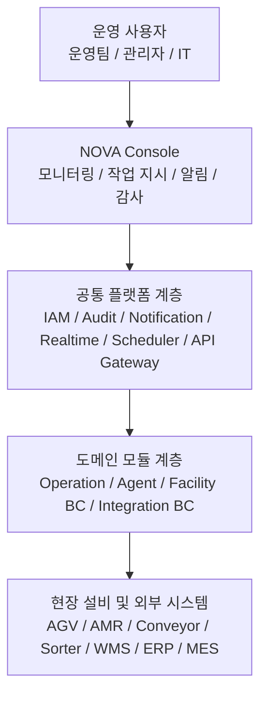

# NOVA Type 2 Deck — 스토리텔링 시나리오

> 목적: `type2.html` 프레젠테이션 덱의 장면 단위 시나리오 기준 문서.
> 제안 발표, 웨비나, 전시 데모처럼 **연속된 내러티브로 설득해야 하는 자리**에서 사용한다.
> `docs/storytelling.md`가 전체 메시지 체계의 사전(辭典)이라면, 이 문서는 **Type 2 덱 전용 각본**이다.

---

## 0. 문서 사용 원칙

- 한 슬라이드는 한 문장으로 요약되어야 한다. 슬라이드 번호마다 "한 문장 요약"을 두고, 그 문장을 중심으로 비주얼과 카피를 맞춘다.
- 메시지는 `문제 → 원인 → 구조 → 해결 → 증명 → 도입 → 마감` 순서를 따른다. 이는 type2.html 슬라이드 배치와 1:1로 대응한다.
- 숫자, 시간, 고유명사를 우선한다. 형용사는 덜어낸다.
- 긴 설명이 필요하면 카피 대신 패널(다크 톤)에 배치하고, 메인 카피는 호흡을 짧게 유지한다.
- 덱의 톤은 **"차분한 엔지니어링 프레젠스"**. 과장 없이, 그러나 구조가 보이도록.

---

## 1. NOVA 개요

### 브랜드 정의
**NOVA** — Idenflu의 물류 운영 플랫폼 브랜드. WES(Warehouse Execution System)와 WCS(Warehouse Control System) 영역을 하나의 표준 플랫폼으로 통합해 제공한다.

### 한 줄 포지셔닝
> 설비 모니터링 · 작업 지시 · 알림 · 보안 · 스케줄링을 **표준화된 플랫폼**으로 통합한 WES/WCS 솔루션.

### 발표용 엘리베이터 피치 (30초 버전)
레거시 현장에서는 설비 모니터링, 작업 지시, 알림, 감사가 서로 다른 시스템에 흩어져 있어 장애 인지는 늦고, 판단은 보고서에 의존하며, 감사 준비에는 며칠이 걸립니다.
NOVA는 이 파편화된 구조를 표준화된 플랫폼 하나로 대체합니다. 실시간 모니터링부터 RBAC 기반 보안, 멀티채널 알림, 변경 감사, 작업 스케줄링까지 단일 콘솔·단일 계약으로 제공합니다.
결과는 단순합니다. 장애는 실시간으로 감지되고, 운영팀은 화면을 전환하지 않으며, 관리자는 감사 전날 로그를 수작업으로 모으지 않습니다.

### 지금 필요한 이유 (발표 오프닝용 3줄)
- **설비 밀도 증가** — AGV·AMR·소터·컨베이어가 동시에 운영되는 현장이 표준이 되었다. 설비별 개별 솔루션만으로는 통합 가시성을 확보할 수 없다.
- **컴플라이언스 압력 강화** — 변경 이력 추적과 접근 감사 요구가 강해지고 있다. 사후 취합 방식으로는 대응 한계가 명확하다.
- **클라우드 네이티브 전환 수요** — 온프레미스 단일 벤더 종속에서 벗어나 독립 모듈 단위로 확장 가능한 구조가 필요하다.

---

## 2. 제품 특징

Type 2 덱은 아래 네 가지 특징을 네 번 반복해 청중의 기억에 고정시킨다. 발표자는 각 슬라이드의 "One-liner"와 이 네 가지 특징을 교차 매핑해 설명한다.

| 특징 | 정의 | Type 2 덱에서 증명되는 슬라이드 |
|---|---|---|
| **표준화된 플랫폼 기반 운영** | 프로젝트마다 처음부터 다시 만들지 않고, 검증된 공통 플랫폼 위에서 구현·운영한다. | 04. Platform Architecture |
| **구성 유연성** | WES/WCS를 대규모 복합 설비 중심으로도, 단순 운영 중심으로도 구성할 수 있다. 현장에 맞춰 범위만 선택 적용. | 07. Adoption Timeline |
| **이벤트 기반 실시간성** | 판단의 기준이 보고서가 아니라 이벤트 스트림이다. 감지–알림–재배분–감사가 자동으로 이어진다. | 05. Realtime Loop |
| **모듈러 확장성** | 설비별 요구는 독립 BC(Bounded Context)로 수용한다. 새 설비·새 센터를 붙여도 플랫폼 전체를 다시 만들지 않는다. | 06. Core Messages (확장성) |

### 엔터프라이즈 모듈 (8종)
발표 중 "8+ 모듈"이라는 수치를 말할 때 참조한다. 슬라이드 01 hero-metrics의 `8+` 근거.

| 모듈 | 역할 |
|---|---|
| Operation | 입출고 흐름, 작업 오더, 라우팅 제어 |
| Agent | 이기종 설비 프로토콜 표준화 및 직접 통신 |
| IAM | RBAC 기반 사용자 인증과 역할 제어 |
| Audit | 변경 이력 추적과 무결성 감사 로그 |
| Notification | Email / SMS / 사내 메신저 멀티채널 알림 |
| Realtime | WebSocket 기반 쌍방향 실시간 동기화 |
| Scheduling | Cron 기반 예측 가능한 배치 엔진 |
| Configuration | 타입 검증이 포함된 전역 설정 패널 |

---

## 3. 플랫폼 아키텍처

NOVA는 공통 플랫폼 계층 위에 운영 모듈과 설비 연동 모듈을 분리해 쌓는 4계층 구조를 가진다. 이 구조는 슬라이드 04에서 `stack-diagram`으로 시각화된다.

### 아키텍처 원칙 (발표 중 구두 부연용)

- **공통 기능 표준화** — 인증, 권한, 감사, 알림, 스케줄링, 실시간 스트림은 플랫폼 공통 계층에서 일관되게 제공한다. 한 번만 만든다.
- **도메인 모듈 분리** — Operation · Agent · Facility BC · Integration BC가 서로 독립적이라 설비별 요구를 독립 반영한다.
- **운영과 연동의 분리** — 사용자 경험을 담당하는 콘솔 계층과 실제 설비 연동 계층을 분리해 변경 영향을 최소화한다.
- **확장 중심 구조** — 새 설비·새 센터를 추가할 때 공통 플랫폼을 흔들지 않고 필요한 모듈만 확장한다.

### 통신 인터페이스 (질문 대응용)

| 구간 | 프로토콜 | 비고 |
|---|---|---|
| Console ↔ 공통 플랫폼 | gRPC / HTTPS | API Gateway 단일 진입 |
| 공통 플랫폼 ↔ 사용자 | WebSocket | 실시간 Snapshot-first Delta push |
| 공통 플랫폼 ↔ 도메인 모듈 | 이벤트 버스 (Kafka / MQTT 선택) | 장애 격리 |
| 도메인 모듈 ↔ 현장 설비 | VDA5050 · PLC · TCP/Socket · REST | Agent가 프로토콜 차이를 흡수 |
| 외부 연동 | WMS / ERP / MES REST · gRPC | Integration BC에서 수렴 |

### 발표 중 자주 받는 질문 (백업 카드)

- **"기존 WMS를 그대로 써도 되나요?"** — 가능합니다. Integration BC가 WMS/ERP/MES와 수렴하는 지점이며, NOVA는 WES/WCS 계층에서 동작합니다.
- **"온프레미스와 클라우드 모두 지원하나요?"** — 공통 플랫폼 계층이 동일하게 제공됩니다. 배포 토폴로지에 따라 이벤트 버스 선택(Kafka / MQTT)만 달라집니다.
- **"설비 하나가 죽으면 전체가 멈추나요?"** — 도메인 모듈이 BC 단위로 독립되어 있어 장애가 플랫폼 전체로 전파되지 않습니다.

---

## 4. 내러티브 아크

Type 2 덱은 8개의 슬라이드가 다음 7단계 아크를 이룬다.

| 단계 | 슬라이드 | 역할 |
|---|---|---|
| Hook | 01. Hero | 단일 문장으로 약속을 건넨다 |
| Pain | 02. Hidden Cost | 고통을 "비용 누수"로 재정의한다 |
| Cause | 03. Legacy Structure | 고통이 반복되는 구조적 이유를 드러낸다 |
| Answer | 04. Platform Architecture | NOVA의 구조적 답을 시각화한다 |
| Proof | 05. Realtime Loop | 운영이 어떻게 움직이는지 증명한다 |
| Value | 06. Core Messages | 세 가지 핵심 가치로 압축한다 |
| Plan | 07. Adoption + Persona | 어떻게 시작하고 누가 얻는지 보여준다 |
| Seal | 08. Closing | 한 문장의 약속으로 덱을 닫는다 |

덱의 최종 목표는 **"NOVA는 실시간성·통합성·확장성을 동시에 확보한 WES/WCS 플랫폼이다"**라는 문장을 청중이 스스로 떠올리게 하는 것이다.

---

## 5. 슬라이드별 시나리오

각 슬라이드는 다음 구조로 기록한다.

- **Eyebrow**: 상단 라벨(섹션 태그)
- **Title**: 슬라이드 헤드라인
- **Lead**: 헤드라인 보조 카피
- **Key Visual**: 슬라이드가 구현하는 비주얼 장치
- **Proof / Points**: 카드, 칩, 수치 등 근거 요소
- **One-liner**: 이 슬라이드를 한 문장으로 요약한 문장
- **Speaker Note**: 발표자가 구두로 덧붙일 한두 문장

---

### 01. Hero — 약속을 건넨다

- **Eyebrow**: Problem to Proof
- **Title**: 흩어진 물류 운영을 하나의 콘솔로
- **Lead**: NOVA는 설비 모니터링, 작업 지시, 알림, 보안, 감사, 스케줄링을 표준화된 플랫폼으로 통합합니다. 운영팀은 화면을 오가지 않고, 장애는 보고서가 아니라 이벤트 스트림으로 감지합니다.
- **Key Visual**: 좌측 텍스트 패널 + 우측 다크 패널(Realtime Control Surface) — 상단에 연속 게이지(pulseBar) 애니메이션, 하단에 Alert / Audit 카드 2개
- **Proof / Points** (hero-metrics 4종):
  - `8+` 통합 엔터프라이즈 모듈
  - `1` 단일 콘솔, 단일 운영 기준
  - `Live` 실시간 이벤트 중심 운영
  - `Scale` 설비 추가 시 모듈만 확장
- **One-liner**: 화면은 하나, 기준도 하나다.
- **Speaker Note**: "이 덱은 하나의 약속으로 시작합니다 — 흩어진 운영을 한 콘솔로 모읍니다. 그 이유와 구조를 8개의 장면으로 보여드리겠습니다."

---

### 02. Hidden Cost — 고통을 비용으로 번역한다

- **Eyebrow (alt)**: Hidden Cost
- **Title**: 레거시의 문제는 불편이 아니라 비용 누수입니다
- **Lead**: 현장 고통은 눈에 잘 보이지 않습니다. 하지만 파편화된 시스템, 지연된 판단, 감사 공백, 확장 장벽이 매일 조금씩 처리량과 시간을 잃게 만듭니다.
- **Key Visual**: 6개의 `pain-card`(01~06) 그리드 + 하단에 `cost-ribbon` (인지 지연 → 판단 오류 → 다운타임 확대 → 조용한 비용 누수)
- **Proof / Points**:
  - 01 파편화된 시스템 — 모니터링, 작업 지시, 알림 앱을 번갈아 열어야 합니다
  - 02 지연된 의사결정 — 어제의 보고서로 오늘의 병목을 판단합니다
  - 03 보안·감사 공백 — 누가 설정을 바꿨는지 즉시 답하지 못합니다
  - 04 예측 불가한 비용 — 벤더별 라이선스와 유지보수가 계속 누적됩니다
  - 05 취약한 안정성 — 연동 하나의 장애가 전체 운영 리스크로 번집니다
  - 06 높은 확장 장벽 — 새 설비를 붙일 때마다 재개발 프로젝트가 시작됩니다
- **One-liner**: 불편이 아니라, 매일 새어나가는 처리량과 시간이다.
- **Speaker Note**: "이 여섯 가지는 고객사 인터뷰에서 반복적으로 들었던 표현입니다. 중요한 건 마지막 리본 — 이 네 단계를 거치며 비용이 '조용히' 쌓인다는 점입니다."

---

### 03. Legacy Structure — 고통이 반복되는 이유

- **Eyebrow (alt)**: Legacy Structure
- **Title**: 문제가 반복되는 이유는 구조가 분리돼 있기 때문입니다
- **Lead**: (생략 — 좌측 패널의 legacy-map이 설명을 대체)
- **Key Visual (split-grid)**:
  - **Left (strong panel)**: Vendor A / B / C 3개 노드로 이루어진 `legacy-map`. 노드 사이에 `connector-note`("데이터와 책임이 끊겨 있습니다", "알림과 감사는 사후 대응으로 남습니다")
  - **Right (panel)**: "Why It Breaks" — 4개의 `reason-item`
- **Proof / Points** (reason-list):
  - 운영 화면과 설비 연동이 분리돼 있습니다
  - 공통 기능이 플랫폼이 아니라 프로젝트별 부속물입니다
  - 새 설비 추가가 확장이 아니라 재개발이 됩니다
  - 결국 운영팀은 시스템을 관리하는 대신 예외를 수습합니다
- **One-liner**: 증상이 반복되는 이유는 구조 안에 있다.
- **Speaker Note**: "좌측은 눈에 보이는 증상, 우측은 그 아래의 구조입니다. 증상만 고치면 다시 같은 문제가 돌아옵니다."

---

### 04. Platform Architecture — 구조적 답

- **Eyebrow**: Platform Architecture
- **Title**: Nova는 공통 기능을 표준화하고 설비 연동은 모듈로 분리합니다
- **Lead**: (생략 — stack-diagram이 설명을 대체)
- **Key Visual (split-grid, 좌측 dark panel)**:
  1. `stack-layer console` — Nova Console (2.5D Console / Task Control / KPI Dashboard)
  2. `stack-layer platform` — 공통 플랫폼 계층 (IAM / Audit / Notification / Realtime / Scheduler / API Gateway)
  3. `stack-layer domain` — 도메인 모듈 계층 (Operation / Agent / Facility BC / Integration BC)
  4. `stack-layer edge` — 현장 설비 및 외부 시스템 (AGV / AMR / Conveyor / Sorter / WMS / ERP)
- **Proof / Points (우측 principle-list)**:
  - 공통 기능 표준화 — 인증, 권한, 감사, 알림, 스케줄링, 실시간 스트림을 플랫폼 기본값으로 제공
  - 운영과 연동의 분리 — 콘솔 경험과 설비 연동 계층을 분리해 변경 영향을 최소화
  - 도메인 모듈 독립성 — 설비별 요구사항은 BC 단위로 수용하고 기존 운영은 흔들지 않음
  - 새 센터에 같은 구조를 반복 적용 — 한 번 검증한 플랫폼을 다른 설비와 다른 센터로 확장
- **One-liner**: 공통은 표준화하고, 다름은 모듈로 분리한다.
- **Speaker Note**: "이 네 개 계층이 NOVA 아키텍처의 골격입니다. 특히 '공통 플랫폼 계층'이 한 번만 만들어진다는 점이 핵심입니다."

---

### 05. Realtime Loop — 운영이 움직이는 방식

- **Eyebrow**: Realtime Loop
- **Title**: 실시간 운영은 보고가 아니라 이벤트 흐름으로 움직입니다
- **Lead**: Snapshot-first Delta push 구조로 화면과 현장을 지속 동기화합니다. 장애는 감지되고, 알림은 전달되고, 재배분은 실행되고, 이력은 자동으로 남습니다.
- **Key Visual (timeline-grid)**:
  - **Left (flow-rail, 5단계)**: 설비 이벤트 수집 → 이상 징후 감지 → 멀티채널 알림 → 작업 재배분 → 감사 이력 기록
  - **Right (dark panel, Live Timeline)**: 09:14 ~ 09:16 구체 타임라인 4줄
- **Proof / Points (event-feed, 우측)**:
  - 09:14 Sorter-02 overload detected
  - 09:14 Ops alert sent
  - 09:15 Task rerouted to idle lane
  - 09:16 Audit log exported
- **One-liner**: 보고서가 아니라, 2분 안에 기록까지 끝난다.
- **Speaker Note**: "왼쪽이 개념, 오른쪽이 실제 타임라인입니다. '감지 → 알림 → 재배분 → 감사 기록'까지 2분 안에 일어납니다."

---

### 06. Core Messages — 세 가지 가치

- **Eyebrow (alt)**: Core Messages
- **Title**: Nova의 가치는 세 가지로 압축됩니다
- **Key Visual (compare-grid, 3열)**: 통합 / **안정성 (nova — 강조 카드)** / 확장성
- **Proof / Points** (각 카드의 proof-list):
  - **통합**: 단일 콘솔에서 설비 상태와 태스크를 함께 제어 / 공통 플랫폼 계층으로 반복 구축 제거 / 단일 계약 구조로 운영 복잡도 축소
  - **안정성**: Snapshot-first Delta push 기반 동기화 / WebSocket 실시간 스트림과 멀티채널 자동 알림 / 장애 감지부터 조치 이력까지 연속 추적
  - **확장성**: 독립 설비 BC 구조 / 기존 운영 영향 최소화 / 수평 확장 가능한 모듈형 아키텍처
- **One-liner**: 세 단어로 기억한다 — 통합, 안정성, 확장성.
- **Speaker Note**: "앞의 다섯 슬라이드를 세 단어로 접으면 이 세 가지입니다. 제안서와 계약 협상 내내 이 세 개의 축으로 돌아올 겁니다."

---

### 07. Adoption Timeline + Persona Fit — 시작하는 법과 얻는 사람

- **Eyebrow**: Adoption Timeline / Persona Fit
- **Title**: 도입은 일괄 전환이 아니라 작게 검증하고 안정적으로 확장합니다
- **Key Visual (timeline-grid)**:
  - **Left (timeline-card, 5단계)**:
    - 01 진단 · `1~2주` — 운영 구조, 설비 인터페이스, 보안 요구사항 정리
    - 02 파일럿 범위 확정 · `2~3주` — 대상 구간, KPI, 테스트 시나리오 정의
    - 03 플랫폼 연결 · `4~8주` — 공통 플랫폼과 현장 설비를 실데이터로 연동
    - 04 안정화 · `2~4주` — 운영팀이 기준 시스템으로 사용할 수 있게 예외 정리
    - 05 확장 · `이후 지속` — 검증 구조를 다른 설비와 다른 센터로 반복 적용
  - **Right (strong panel, persona-grid 3개)**:
    - 현장 운영팀 — 한 화면에서 대응합니다
    - IT 관리자 — 기존 운영을 멈추지 않고 확장합니다
    - 의사결정자 — 비용과 리스크를 더 빨리 봅니다
- **One-liner**: 5단계로 시작하고, 세 페르소나가 각자의 이득을 얻는다.
- **Speaker Note**: "좌측은 일정, 우측은 이 일정을 통해 누가 무엇을 얻는지입니다. 파일럿 2-3주와 연결 4-8주가 현실적인 앵커입니다."

---

### 08. Closing — 한 문장의 봉인

- **Eyebrow**: Closing Message
- **Title**: 센터가 늘어도 콘솔은 하나
- **Lead**: NOVA는 운영팀이 여러 시스템을 오가며 뒤늦게 대응하던 구조를, 하나의 콘솔에서 실시간으로 감지하고 지시하고 추적하는 구조로 바꿉니다.
- **Key Visual (dark panel, closing-panel)**:
  - 좌측: 디스플레이 카피 + `closing-points` 3줄
  - 우측: `quote-box` (하이라이트 3단어 강조) + `footer-note`
- **Proof / Points (closing-points)**:
  - 표준화된 플랫폼 위에서 공통 기능을 한 번만 구축합니다
  - 이벤트 기반 운영으로 장애 대응 속도와 의사결정 품질을 끌어올립니다
  - 새 설비와 새 센터를 독립 모듈 단위로 확장합니다
- **Quote**: **실시간성**, **통합성**, **확장성**을 동시에 확보하는 WES/WCS 플랫폼
- **Footer note**: 기준 문서 `docs/storytelling.md` / 메시지 흐름 `문제 → 원인 → 결과 → Nova의 해결 → 증명`
- **One-liner**: 센터가 늘어도, 기준은 하나다.
- **Speaker Note**: "이 한 줄만 기억해 주세요 — 센터가 늘어도 콘솔은 하나. 다음 단계는 파일럿 범위를 같이 그리는 일입니다."

---

## 6. 청중 흐름 설계

Type 2 덱은 8분 발표 / 15분 Q&A 포맷에 맞춰 설계됐다. 청중의 집중 곡선을 고려해 다음과 같이 배치한다.

| 시간 | 슬라이드 | 청중 상태 | 발표자의 역할 |
|---|---|---|---|
| 0:00–1:00 | 01 | 탐색 | 약속을 제시한다 |
| 1:00–2:30 | 02–03 | 공감 진입 | 비용과 구조를 이어 붙인다 |
| 2:30–4:30 | 04 | 학습 | 계층을 손가락으로 짚으며 설명한다 |
| 4:30–6:00 | 05 | 검증 | 타임라인을 초 단위로 읽어 준다 |
| 6:00–7:00 | 06 | 압축 | 세 단어로 기억 고정 |
| 7:00–8:00 | 07–08 | 결심 | 다음 행동(파일럿)을 제시한다 |

---

## 7. 비주얼 · 모션 가이드

- **색 사용**: 본문은 화이트톤, 다크 패널(Hero 우측, Realtime Live, Closing)은 "강조 구간"에서만 사용한다. 다크 패널은 덱 전체에서 3번만 나와야 시선이 집중된다.
- **모션**: 슬라이드 전환은 가로 슬라이딩(`cubic-bezier(0.2, 0.8, 0.2, 1)`)으로 유지. 슬라이드 내부 모션은 Hero의 `pulseBar`만 살려 두고, 나머지 슬라이드는 정적 유지.
- **비주얼 밀도 원칙**: 한 슬라이드에 카드 6개 이하, 칩 12개 이하. 초과하면 두 개 슬라이드로 쪼갠다.
- **타이포**: 제목은 `Space Grotesk`, 본문은 `IBM Plex Sans KR`. 본문 최대 가독폭은 760px.
- **반응형**: 1100px 이하에서 2열 → 1열, 780px 이하에서 단일 열. 발표용이므로 1280px 이상 해상도를 기본값으로 가정한다.

---

## 8. 카피 편집 체크리스트

슬라이드 카피를 수정할 때 다음을 확인한다.

- [ ] 슬라이드마다 "One-liner" 한 문장을 먼저 쓰고, 그에 맞춰 나머지 문장을 편집했는가
- [ ] 형용사("혁신적인", "차세대")와 약한 종결("~할 수 있습니다")을 제거했는가
- [ ] 숫자(`8+`, `2~3주`, `09:14`)를 유지했는가
- [ ] 다크 패널은 3회 이하로 등장하는가
- [ ] 한 슬라이드가 두 가지 이상을 주장하지 않는가
- [ ] 마지막 슬라이드 한 문장(`센터가 늘어도 콘솔은 하나`)이 훼손되지 않았는가

---

## 9. 변경 관리

- 이 문서는 `type2.html`과 1:1 대응한다. 슬라이드 구성이 바뀌면 이 문서를 먼저 수정하고, 그 다음 HTML을 수정한다.
- 메시지 원칙·정의는 `docs/storytelling.md`가 상위 문서다. 이 문서는 그 하위 덱 각본이다. 충돌이 생기면 `storytelling.md`를 우선한다.
- 한 슬라이드를 대폭 바꾸려면 위의 "청중 흐름 설계" 표에서 시간 배분이 여전히 성립하는지 먼저 검토한다.

---

*최초 작성: 2026-04-15*
*문서 관리: Idenflu — NOVA 제품팀*
