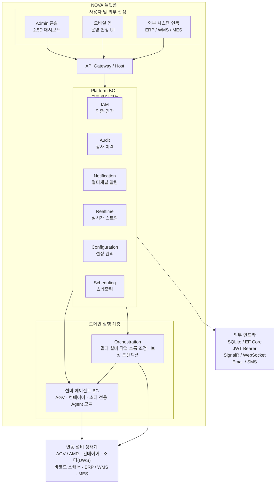

# NOVA 콘텐츠·구성·디자인 정리 양식

> 목적: 소개 페이지, 발표자료, 영업자료를 다듬기 전에 내용과 화면 구성을 한곳에 정리한다.
> 사용법: 각 항목의 질문에 답하면서 초안을 채우고, 확정된 문장은 실제 HTML/슬라이드 카피로 옮긴다.

---

## 1. 작업 기본 정보

> 제안 발표, 내부 검토, 기술 설명처럼 구조와 근거까지 설명하는 용도.

| 항목 | 내용 |
| --- | --- |
| 작업 대상 | 예: `proposal.html`, 발표자료, 상세 제안서 |
| 주요 목적 | 예: 도입 필요성, 제품 구조, 적용 방식까지 설득하기 |
| 주요 독자 | 예: 물류 운영 책임자, IT 관리자, 설비/자동화 담당자 |
| 핵심 메시지 | 예: 공통 기능은 Platform, 업무는 Operation, 설비 연동은 Agent로 분리한다 |
| 기대 행동 | 예: 도입 검토, 파일럿 범위 논의, 기술 미팅 진행 |
| 분량 기준 | 예: 8~12개 섹션, 15~30분 발표 |
| 작성 기준일 |  |

---

## 2. 한 줄 정의

### 제품 한 줄 설명

> 예: NOVA는 물류 운영에 필요한 작업 실행, 설비 연동, 실시간 모니터링, 알림, 감사, 권한을 하나의 표준 플랫폼으로 통합하는 WES/WCS 솔루션입니다.

최종 문안:

> NOVA는 물류 운영에 필요한 작업 실행, 설비 연동, 실시간 모니터링, 알림, 감사, 권한을 하나로 통합한 WES/WCS 운영 플랫폼입니다.

### 핵심 약속

> 고객에게 가장 강하게 남겨야 할 약속을 한 문장으로 적는다.

최종 문안:

> NOVA는 물류 현장의 작업과 설비 상태를 실시간으로 보여주고, 안정적인 운영 기반 위에서 현장 변화에 맞춰 유연하게 확장되며, 고객 요구사항을 정확하게 반영하는 WES/WCS 운영 플랫폼입니다.

핵심 흐름:

| 순서 | 약속 | 설명 |
| --- | --- | --- |
| 1 | 운영 가시성 | 작업, 설비, 알림, 이력을 한 화면에서 확인해 현장 상황을 빠르게 파악한다. |
| 2 | 안정성 | 작업 실행, 설비 연동, 알림, 감사, 권한을 일관된 구조로 묶어 운영 흔들림을 줄인다. |
| 3 | 확장성/유연성 | 센터, 설비, 업무 범위가 달라져도 필요한 모듈을 기준으로 확장할 수 있다. |
| 4 | 요구사항의 정확성 | 현장 업무와 설비 특성을 분리해 분석하고, 실제 운영 조건에 맞는 기능으로 반영한다. |

---

## 3. 대상 고객과 상황

| 구분 | 내용 |
| --- | --- |
| 고객 유형 |  |
| 현재 운영 환경 |  |
| 가장 큰 불편 |  |
| 구매 또는 검토 계기 |  |
| 의사결정 기준 |  |
| 우려 사항 |  |

### 고객이 실제로 할 질문

| 질문 | 답변 방향 |
| --- | --- |
|  |  |
|  |  |
|  |  |

---

## 4. 핵심 메시지 구조

### 메인 메시지

> 첫 화면이나 발표 초반에 보여줄 가장 중요한 문장.

최종 문안:

> 

### 보조 메시지 3개

| 순서 | 메시지 | 설명 |
| --- | --- | --- |
| 1 |  |  |
| 2 |  |  |
| 3 |  |  |

### 반복해서 사용할 표현

- 
- 
- 

### 피해야 할 표현

- 
- 
- 

---

## 5. 문제 정의

> 고객의 문제를 기능 부족이 아니라 운영상 손실과 구조적 비효율로 설명한다.

| 문제 | 현장에서 보이는 모습 | 발생하는 손실 |
| --- | --- | --- |
|  |  |  |
|  |  |  |
|  |  |  |

### 문제 요약 문장

> 

---

## 6. 해결 방식

| 고객 문제 | NOVA의 해결 | 증명 근거 |
| --- | --- | --- |
|  |  |  |
|  |  |  |
|  |  |  |

### Before / After

| 상황 | Before | After |
| --- | --- | --- |
|  |  |  |
|  |  |  |
|  |  |  |

---

## 7. 제품 구조

### 플랫폼 아키텍처

> `type0.html`의 "엔터프라이즈급 모듈러 아키텍처" 내용을 Mermaid로 정리한 초안.
> 하나의 배포 단위 안에서 강한 모듈 경계를 유지하고, 각 BC가 독립적으로 진화하는 구조를 기준으로 한다.

### 유저 인터페이스

> 웹 애플리케이션 UI 구성과 주요 화면을 정리하는 자리.
> 추후 실제 화면 캡처, 와이어프레임, 또는 HTML 구현안을 연결한다.

| 화면 | 역할 | 포함할 주요 요소 | 메모 |
| --- | --- | --- | --- |
| 대시보드 | 전체 운영 상태를 한눈에 보여준다 | 작업 현황, 설비 상태, 알림, KPI |  |
| 설비 모니터링 | 설비별 상태와 장애를 확인한다 | AGV/AMR, 컨베이어, 소터, 상태 타임라인 |  |
| 작업 실행 관리 | 입고, 출고, 이동, 피킹 등 작업 흐름을 관리한다 | 작업 목록, 우선순위, 진행 상태, 예외 처리 |  |
| 알림/이벤트 | 장애와 운영 이벤트를 추적한다 | 심각도, 발생 시각, 조치 상태, 담당자 |  |
| 감사/권한 | 접근 권한과 변경 이력을 관리한다 | 사용자, 역할, 권한, 변경 로그 |  |

UI 시각 자료:

| 자료 | 위치 | 상태 |
| --- | --- | --- |
| 웹 애플리케이션 메인 화면 |  | 준비 전 |
| 운영 대시보드 화면 |  | 준비 전 |
| 설비 모니터링 화면 |  | 준비 전 |
| 작업/이벤트 상세 화면 |  | 준비 전 |

---

## 8. 구성 초안

> 페이지 또는 발표자료의 흐름을 먼저 정리한다.

| 순서 | 섹션/슬라이드 제목 | 역할 | 핵심 문장 | 필요한 시각 요소 |
| --- | --- | --- | --- | --- |
| 1 |  | 첫인상 형성 |  |  |
| 2 |  | 문제 제기 |  |  |
| 3 |  | 해결 구조 제시 |  |  |
| 4 |  | 제품 구성 설명 |  |  |
| 5 |  | 도입 효과 제시 |  |  |
| 6 |  | 행동 유도 |  |  |

---

## 9. 섹션별 상세 카피

### 1. Hero / 첫 화면

| 항목 | 문안 |
| --- | --- |
| 제목 |  |
| 보조 설명 |  |
| 주요 CTA |  |
| 보조 CTA |  |
| 시각 요소 |  |

### 2. 문제 제기

| 항목 | 문안 |
| --- | --- |
| 섹션 제목 |  |
| 요약 문장 |  |
| 문제 1 |  |
| 문제 2 |  |
| 문제 3 |  |

### 3. 해결 구조

| 항목 | 문안 |
| --- | --- |
| 섹션 제목 |  |
| 요약 문장 |  |
| 핵심 구조 |  |
| 강조할 차별점 |  |

### 4. 제품 모듈

| 모듈 | 고객에게 설명할 표현 | 강조 포인트 |
| --- | --- | --- |
| Platform |  |  |
| Operation |  |  |
| Agent |  |  |
| Orchestration |  |  |

### 5. 도입 효과

| 효과 | 설명 | 근거 |
| --- | --- | --- |
|  |  |  |
|  |  |  |
|  |  |  |

### 6. CTA / 마무리

| 항목 | 문안 |
| --- | --- |
| 마무리 문장 |  |
| CTA 문구 |  |
| CTA 보조 설명 |  |

---

## 10. 디자인 방향

### 전체 인상

| 항목 | 방향 |
| --- | --- |
| 톤 | 예: 신뢰감 있는, 정교한, 운영 중심의, 과장 없는 |
| 밀도 | 예: 정보 밀도 높음, 여백 충분, 발표형, 랜딩형 |
| 분위기 | 예: 엔터프라이즈 SaaS, 물류 관제, 기술 제안 |
| 피해야 할 인상 | 예: 지나치게 마케팅스럽거나 추상적인 느낌 |

### 시각 언어

| 요소 | 방향 |
| --- | --- |
| 컬러 |  |
| 타이포그래피 |  |
| 아이콘 |  |
| 다이어그램 |  |
| 화면/이미지 |  |
| 애니메이션 |  |

### 레이아웃 원칙

- 
- 
- 

---

## 11. 필요한 시각 자료

| 자료 | 용도 | 준비 상태 | 메모 |
| --- | --- | --- | --- |
| 제품 구조 다이어그램 |  |  |  |
| 실시간 운영 화면 |  |  |  |
| Before/After 비교 |  |  |  |
| 도입 단계 흐름 |  |  |  |
| 산업별 적용 예시 |  |  |  |

---

## 12. 검토 체크리스트

### 내용

- [ ] 첫 화면에서 NOVA가 무엇인지 바로 이해된다.
- [ ] 고객 문제가 기능 나열이 아니라 운영 상황으로 설명된다.
- [ ] NOVA의 해결 방식이 구조적으로 보인다.
- [ ] Platform, Operation, Agent, Orchestration의 역할이 섞이지 않는다.
- [ ] 과장 표현보다 검증 가능한 표현을 사용한다.

### 구성

- [ ] `문제 -> 원인 -> 해결 -> 증명 -> 행동 유도` 흐름이 자연스럽다.
- [ ] 각 섹션의 역할이 겹치지 않는다.
- [ ] 핵심 메시지가 반복되지만 지루하게 중복되지 않는다.
- [ ] 기술 설명이 너무 앞에 나오지 않는다.

### 디자인

- [ ] 정보 밀도가 높아도 읽기 쉽다.
- [ ] 핵심 문장과 보조 설명의 위계가 명확하다.
- [ ] 다이어그램이 장식이 아니라 이해를 돕는다.
- [ ] CTA가 눈에 보이지만 과하게 튀지 않는다.
- [ ] 모바일과 데스크톱에서 텍스트가 겹치지 않는다.

---

## 13. 최종 결정 사항

| 항목 | 결정 |
| --- | --- |
| 최종 메인 메시지 |  |
| 최종 섹션 순서 |  |
| 반드시 포함할 모듈 |  |
| 제외할 내용 |  |
| 다음 작업 |  |
