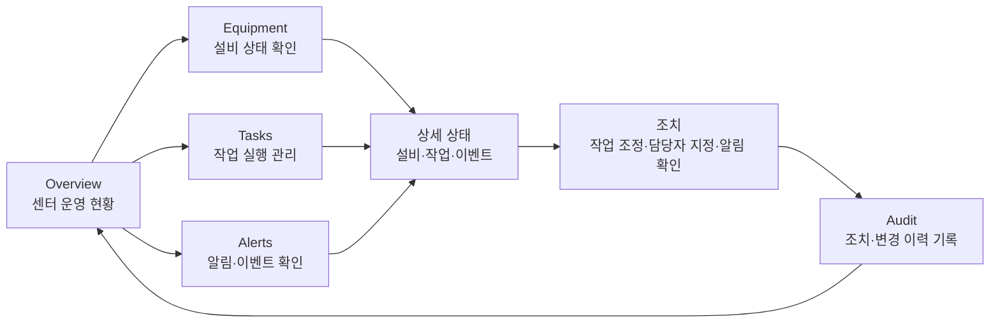

# NOVA 콘텐츠·구성·디자인 정리 양식

> 목적: 소개 페이지, 발표자료, 영업자료를 다듬기 전에 내용과 화면 구성을 한곳에 정리한다.
> 사용법: 각 항목의 질문에 답하면서 초안을 채우고, 확정된 문장은 실제 HTML/슬라이드 카피로 옮긴다.

---

## 1. 작업 기본 정보

> 제안 발표, 내부 검토, 기술 설명처럼 구조와 근거까지 설명하는 용도.

| 항목 | 내용 |
| --- | --- |
| 작업 대상 | `proposal.html`, 상세 소개자료 |
| 주요 목적 | NOVA의 도입 필요성, 제품 구조, 적용 방식을 설득하기 |
| 주요 독자 | 물류 운영 책임자, IT 관리자, 설비/자동화 담당자, 의사결정자 |
| 핵심 메시지 | NOVA는 물류 운영을 실시간으로 가시화하고, 안정적이며 유연하게 확장 가능한 WES/WCS 운영 플랫폼이다 |
| 기대 행동 | 도입 검토, 파일럿 범위 논의, 기술 미팅 진행 |
| 분량 기준 | 8~12개 섹션, 15~30분 발표 |
| 기존 HTML 활용 기준 | 기존 `index.html`, `type0.html`, `type1.html`, `type2.html`은 참고용으로만 보고, 최종 자료는 새 구조로 다시 작성한다 |
| 작성 기준일 | 2026-04-25 |

---

## 2. 한 줄 정의

### 제품 한 줄 설명

> 예: NOVA는 물류 운영에 필요한 작업 실행, 설비 연동, 실시간 모니터링, 알림, 감사, 권한을 하나의 표준 플랫폼으로 통합하는 WES/WCS 솔루션입니다.

최종 문안:

> NOVA는 물류 운영에 필요한 작업 실행, 설비 연동, 실시간 모니터링, 알림, 감사, 권한을 하나로 통합한 WES/WCS 운영 플랫폼입니다.

### 핵심 약속

> 고객에게 가장 강하게 남겨야 할 약속을 한 문장으로 적는다.

최종 문안:

> NOVA는 물류 현장의 작업과 설비 상태를 실시간으로 보여주고, 안정적인 운영 기반 위에서 현장 변화에 맞춰 유연하게 확장되며, 고객 요구사항을 정확하게 반영하는 WES/WCS 운영 플랫폼입니다.

핵심 흐름:

| 순서 | 약속 | 설명 |
| --- | --- | --- |
| 1 | 운영 가시성 | 작업, 설비, 알림, 이력을 한 화면에서 확인해 현장 상황을 빠르게 파악한다. |
| 2 | 안정성 | 작업 실행, 설비 연동, 알림, 감사, 권한을 일관된 구조로 묶어 운영 흔들림을 줄인다. |
| 3 | 확장성/유연성 | 센터, 설비, 업무 범위가 달라져도 필요한 모듈을 기준으로 확장할 수 있다. |
| 4 | 요구사항의 정확성 | 현장 업무와 설비 특성을 분리해 분석하고, 실제 운영 조건에 맞는 기능으로 반영한다. |

---

## 3. 대상 고객과 상황

| 구분 | 내용 |
| --- | --- |
| 고객 유형 | 중대형 물류센터, 이커머스 물류, 제조물류, 자동화 설비를 운영하거나 도입하려는 기업 |
| 현재 운영 환경 | WMS, ERP, MES, 설비 제어 시스템, 모니터링 도구가 분리되어 있고 현장별 커스터마이징이 누적된 상태 |
| 가장 큰 불편 | 작업 상태, 설비 상태, 장애 알림, 변경 이력이 여러 시스템에 흩어져 있어 운영 판단과 장애 대응이 늦어진다 |
| 구매 또는 검토 계기 | 신규 센터 구축, 설비 증설, 기존 WES/WCS 고도화, 장애 대응 체계 개선, 운영 데이터 가시화 필요 |
| 의사결정 기준 | 안정적인 운영, 기존 시스템 연동 가능성, 확장성, 현장 요구사항 반영 정확도, 구축 이후 유지보수 용이성 |
| 우려 사항 | 초기 구축 범위가 커질 가능성, 기존 설비와의 연동 난이도, 현장별 예외 처리, 운영 중 장애 대응, 도입 효과 검증 |

### 고객이 실제로 할 질문

| 질문 | 답변 방향 |
| --- | --- |
| 기존 WMS, ERP, 설비를 그대로 사용할 수 있나요? | 기존 시스템을 전제로 연동하고, 설비별 차이는 Agent 모듈로 분리해 흡수한다. |
| 전체 시스템을 한 번에 바꿔야 하나요? | 병목 구간이나 특정 업무부터 시작하고, 검증된 범위를 기준으로 단계적으로 확장한다. |
| 우리 현장의 특수한 요구사항을 반영할 수 있나요? | 업무 규칙과 설비 특성을 분리해 분석하고, Operation, Agent, Orchestration 단위로 정확하게 반영한다. |
| 장애가 발생하면 운영이 전체적으로 멈추지 않나요? | 모듈 경계를 분리하고 실시간 알림, 감사 이력, 상태 추적을 통해 장애 인지와 조치 시간을 줄인다. |
| 도입 효과를 어떻게 확인할 수 있나요? | 작업 처리 상태, 설비 가동 상태, 알림 이력, 예외 처리 데이터를 기준으로 개선 효과를 확인한다. |

---

## 4. 핵심 메시지 구조

### 메인 메시지

> 첫 화면이나 발표 초반에 보여줄 가장 중요한 문장.

최종 문안:

> 흩어진 물류 운영을 하나의 표준 플랫폼으로 연결해, 현장을 실시간으로 보고 안정적으로 실행하며 유연하게 확장합니다.

### 보조 메시지 3개

| 순서 | 메시지 | 설명 |
| --- | --- | --- |
| 1 | 현장을 실시간으로 봅니다 | 작업 상태, 설비 상태, 알림, 이력을 한 화면에서 확인해 운영 판단을 빠르게 만든다. |
| 2 | 운영을 안정적으로 실행합니다 | 작업 실행, 설비 연동, 권한, 감사, 알림을 일관된 구조로 묶어 장애 대응과 운영 추적성을 높인다. |
| 3 | 변화에 맞춰 유연하게 확장합니다 | 업무 규칙, 설비 연동, 실행 흐름을 분리해 센터와 설비가 늘어나도 필요한 모듈 중심으로 확장한다. |

### 반복해서 사용할 표현

- 흩어진 운영을 하나의 기준으로 연결한다.
- 실시간으로 보고, 안정적으로 실행하고, 유연하게 확장한다.
- 공통 기능은 Platform, 업무는 Operation, 설비 연동은 Agent, 실행 흐름은 Orchestration이 맡는다.
- 기존 시스템을 버리는 방식이 아니라, 필요한 영역부터 연결하고 확장한다.
- 현장 요구사항을 구조적으로 분석하고 실제 운영 기능으로 정확하게 반영한다.

### 피해야 할 표현

- 모든 문제를 한 번에 해결한다는 과장 표현
- 단순히 "AI", "DX", "스마트" 같은 유행어로 제품 가치를 설명하는 표현
- 기술 스택만 나열하고 고객 운영 문제와 연결하지 않는 표현
- 기존 WMS, ERP, 설비를 모두 대체한다는 인상을 주는 표현
- 마이크로서비스처럼 현재 제품 구조와 맞지 않는 아키텍처 중심 표현
- 검증 근거 없이 처리량, 비용 절감, 장애 감소율 같은 수치를 제시하는 표현

---

## 5. 문제 정의

> 고객의 문제를 기능 부족이 아니라 운영상 손실과 구조적 비효율로 설명한다.

| 문제 | 현장에서 보이는 모습 | 발생하는 손실 |
| --- | --- | --- |
| 운영 정보가 흩어져 있다 | 작업 상태, 설비 상태, 장애 알림, 변경 이력을 서로 다른 화면과 시스템에서 확인한다 | 장애 인지와 의사결정이 늦어지고, 운영자가 수동으로 상황을 취합해야 한다 |
| 설비와 업무 흐름이 강하게 묶여 있다 | 특정 설비나 프로세스 변경이 생기면 작업 로직, 연동 로직, 화면까지 함께 수정된다 | 변경 범위가 커지고, 신규 설비 추가나 현장별 요구사항 반영에 시간이 오래 걸린다 |
| 운영 이력과 책임 추적이 어렵다 | 누가 설정을 바꿨는지, 어떤 알림이 전달됐는지, 장애 후 어떤 조치가 있었는지 즉시 확인하기 어렵다 | 감사 대응과 장애 원인 분석이 수작업에 의존하고, 재발 방지 기준을 만들기 어렵다 |
| 현장 요구사항이 기능으로 정확히 이어지기 어렵다 | 업무 규칙, 설비 특성, 예외 처리 조건이 한꺼번에 섞여 분석되고 구현된다 | 고객이 요구한 운영 방식과 실제 구현 결과 사이에 차이가 생기고, 반복 수정이 발생한다 |

### 문제 요약 문장

> 기존 물류 운영의 문제는 단일 기능 부족이 아니라, 작업·설비·알림·이력·권한이 분리되어 운영 판단과 변경 대응이 늦어지는 구조적 비효율이다.

---

## 6. 해결 방식

| 고객 문제 | NOVA의 해결 | 증명 근거 |
| --- | --- | --- |
| 운영 정보가 흩어져 있다 | 작업, 설비, 알림, 이력 정보를 하나의 운영 화면과 공통 플랫폼 구조로 연결한다 | `Realtime`, `Notification`, `Audit`, 대시보드 UI |
| 설비와 업무 흐름이 강하게 묶여 있다 | 업무 규칙은 `Operation`, 설비 특화 규칙은 `Agent`, 실행 흐름은 `Orchestration`으로 분리한다 | Platform BC와 도메인 실행 계층을 나눈 모듈러 아키텍처 |
| 운영 이력과 책임 추적이 어렵다 | 변경 이력, 알림 전달, 조치 흐름을 감사 가능한 형태로 남긴다 | `Audit`, `IAM`, 알림/이벤트 로그, 상태 타임라인 |
| 현장 요구사항이 기능으로 정확히 이어지기 어렵다 | 업무 요구, 설비 조건, 예외 흐름을 분리해 분석하고 각 모듈의 책임으로 반영한다 | `Operation`, `Agent`, `Orchestration` 경계와 계약 기반 연동 |

### Before / After

| 상황 | Before | After |
| --- | --- | --- |
| 장애 발생 | 운영자가 여러 화면을 확인하고 전화나 메신저로 상황을 공유한다 | 실시간 상태 변화가 감지되고, 알림과 이벤트 이력으로 조치 흐름을 추적한다 |
| 신규 설비 추가 | 설비 연동, 업무 로직, 화면 변경이 한꺼번에 커진다 | 설비별 `Agent`를 추가하고 필요한 업무/흐름만 연결한다 |
| 운영 정책 변경 | 변경 영향 범위를 파악하기 어렵고 테스트 범위가 넓어진다 | 설정, 권한, 업무 규칙을 분리해 변경하고 감사 이력으로 추적한다 |
| 현장별 요구사항 반영 | 예외 조건이 기존 로직에 누적되어 유지보수가 어려워진다 | 요구사항을 업무, 설비, 오케스트레이션 단위로 나눠 정확히 구현한다 |

---

## 7. 제품 구조

### 플랫폼 아키텍처

> `type0.html`의 "엔터프라이즈급 모듈러 아키텍처" 내용을 Mermaid로 정리한 초안.
> 하나의 배포 단위 안에서 강한 모듈 경계를 유지하고, 각 BC가 독립적으로 진화하는 구조를 기준으로 한다.

### 유저 인터페이스

> NOVA UI는 웹 애플리케이션 기반의 운영 콘솔이다.
> 물류센터 레이아웃, 설비 상태, 작업 흐름, 알림, 감사 이력을 같은 기준의 화면에서 확인하고 조치한다.
> 2.5D 아이소메트릭 레이아웃으로 설비 상태를 모니터링하고, 작업·알림·이벤트·KPI 같은 추가 현황 정보를 함께 확인해 운영 상태를 판단한다.

#### UI 설계 방향

| 원칙 | 설명 |
| --- | --- |
| 공간 기준 인지 | 2.5D 아이소메트릭 레이아웃으로 구역, 라인, 설비 위치와 상태를 표현해 현장 구조를 직관적으로 파악한다. |
| 현황 정보 결합 | 설비 상태만 따로 보지 않고 작업, 알림, 이벤트, KPI를 함께 보여줘 운영 판단에 필요한 맥락을 제공한다. |
| 실시간 상태 중심 | 작업 상태와 설비 상태를 실시간 이벤트 스트림으로 동기화한다. |
| 예외 우선 대응 | 정상 상태보다 장애, 지연, 임계치 초과, 미조치 알림을 먼저 보이게 한다. |
| 실행과 추적 연결 | 작업 조정, 알림 확인, 조치 기록, 감사 이력이 끊기지 않게 이어진다. |
| 웹 기반 공유 | 별도 설치 없이 브라우저에서 접근하고, 운영팀과 관리자가 같은 화면 기준을 공유한다. |

#### 웹 애플리케이션 UI 구성

| 화면 | 역할 | 포함할 주요 요소 | 메모 |
| --- | --- | --- | --- |
| Overview / 대시보드 | 전체 운영 상태를 한눈에 보여준다 | 2.5D 센터 레이아웃, 활성 작업, 설비 상태, 알림 요약, 주요 KPI | 첫 화면 역할 |
| Tasks / 작업 실행 관리 | 입고, 출고, 이동, 피킹 등 작업 흐름을 관리한다 | 작업 목록, 우선순위, 진행률, 담당 설비, 예외 상태 | Operation과 연결 |
| Equipment / 설비 모니터링 | 설비별 상태와 장애를 확인한다 | AGV/AMR, 컨베이어, 소터, 상태 타임라인, 장애 상세 | Agent와 연결 |
| Alerts / 알림·이벤트 | 장애와 운영 이벤트를 추적한다 | 심각도, 발생 시각, 대상 설비, 조치 상태, 담당자 | Notification, Realtime과 연결 |
| Audit / 감사 이력 | 변경 이력과 조치 근거를 조회한다 | 사용자, 변경 대상, 변경 전후 값, 상관관계 ID, 이벤트 이력 | Audit, IAM과 연결 |
| Settings / 운영 설정 | 센터별 운영 기준과 권한을 관리한다 | 사용자, 역할, 알림 기준, 스케줄, 운영 파라미터 | Configuration, Scheduling과 연결 |

#### 주요 화면 흐름

#### UI 시각 자료

| 자료 | 위치 | 상태 |
| --- | --- | --- |
| 웹 애플리케이션 메인 화면 | Overview / 대시보드 | 준비 전 |
| 2.5D 센터 레이아웃 | Overview / Equipment | 준비 전 |
| 설비 상태 상세 화면 | Equipment | 준비 전 |
| 작업 실행 목록과 상세 화면 | Tasks | 준비 전 |
| 알림·이벤트 타임라인 | Alerts | 준비 전 |
| 감사 이력 조회 화면 | Audit | 준비 전 |
| 운영 설정과 권한 관리 화면 | Settings | 준비 전 |

---

## 8. 구성 초안

> 페이지 또는 발표자료의 흐름을 먼저 정리한다.

| 순서 | 섹션/슬라이드 제목 | 역할 | 핵심 문장 | 필요한 시각 요소 |
| --- | --- | --- | --- | --- |
| 1 |  | 첫인상 형성 |  |  |
| 2 |  | 문제 제기 |  |  |
| 3 |  | 해결 구조 제시 |  |  |
| 4 |  | 제품 구성 설명 |  |  |
| 5 |  | 도입 효과 제시 |  |  |
| 6 |  | 행동 유도 |  |  |

---

## 9. 섹션별 상세 카피

### 1. Hero / 첫 화면

| 항목 | 문안 |
| --- | --- |
| 제목 |  |
| 보조 설명 |  |
| 주요 CTA |  |
| 보조 CTA |  |
| 시각 요소 |  |

### 2. 문제 제기

| 항목 | 문안 |
| --- | --- |
| 섹션 제목 |  |
| 요약 문장 |  |
| 문제 1 |  |
| 문제 2 |  |
| 문제 3 |  |

### 3. 해결 구조

| 항목 | 문안 |
| --- | --- |
| 섹션 제목 |  |
| 요약 문장 |  |
| 핵심 구조 |  |
| 강조할 차별점 |  |

### 4. 제품 모듈

| 모듈 | 고객에게 설명할 표현 | 강조 포인트 |
| --- | --- | --- |
| Platform |  |  |
| Operation |  |  |
| Agent |  |  |
| Orchestration |  |  |

### 5. 도입 효과

| 효과 | 설명 | 근거 |
| --- | --- | --- |
|  |  |  |
|  |  |  |
|  |  |  |

### 6. CTA / 마무리

| 항목 | 문안 |
| --- | --- |
| 마무리 문장 |  |
| CTA 문구 |  |
| CTA 보조 설명 |  |

---

## 10. 디자인 방향

### 전체 인상

| 항목 | 방향 |
| --- | --- |
| 톤 | 예: 신뢰감 있는, 정교한, 운영 중심의, 과장 없는 |
| 밀도 | 예: 정보 밀도 높음, 여백 충분, 발표형, 랜딩형 |
| 분위기 | 예: 엔터프라이즈 SaaS, 물류 관제, 기술 제안 |
| 피해야 할 인상 | 예: 지나치게 마케팅스럽거나 추상적인 느낌 |

### 시각 언어

| 요소 | 방향 |
| --- | --- |
| 컬러 |  |
| 타이포그래피 |  |
| 아이콘 |  |
| 다이어그램 |  |
| 화면/이미지 |  |
| 애니메이션 |  |

### 레이아웃 원칙

- 
- 
- 

---

## 11. 필요한 시각 자료

| 자료 | 용도 | 준비 상태 | 메모 |
| --- | --- | --- | --- |
| 제품 구조 다이어그램 |  |  |  |
| 실시간 운영 화면 |  |  |  |
| Before/After 비교 |  |  |  |
| 도입 단계 흐름 |  |  |  |
| 산업별 적용 예시 |  |  |  |

---

## 12. 검토 체크리스트

### 내용

- [ ] 첫 화면에서 NOVA가 무엇인지 바로 이해된다.
- [ ] 고객 문제가 기능 나열이 아니라 운영 상황으로 설명된다.
- [ ] NOVA의 해결 방식이 구조적으로 보인다.
- [ ] Platform, Operation, Agent, Orchestration의 역할이 섞이지 않는다.
- [ ] 과장 표현보다 검증 가능한 표현을 사용한다.

### 구성

- [ ] `문제 -> 원인 -> 해결 -> 증명 -> 행동 유도` 흐름이 자연스럽다.
- [ ] 각 섹션의 역할이 겹치지 않는다.
- [ ] 핵심 메시지가 반복되지만 지루하게 중복되지 않는다.
- [ ] 기술 설명이 너무 앞에 나오지 않는다.

### 디자인

- [ ] 정보 밀도가 높아도 읽기 쉽다.
- [ ] 핵심 문장과 보조 설명의 위계가 명확하다.
- [ ] 다이어그램이 장식이 아니라 이해를 돕는다.
- [ ] CTA가 눈에 보이지만 과하게 튀지 않는다.
- [ ] 모바일과 데스크톱에서 텍스트가 겹치지 않는다.

---

## 13. 최종 결정 사항

| 항목 | 결정 |
| --- | --- |
| 최종 메인 메시지 |  |
| 최종 섹션 순서 |  |
| 반드시 포함할 모듈 |  |
| 제외할 내용 | 기존 HTML의 섹션 구성과 디자인은 그대로 재사용하지 않는다. 필요한 메시지와 구조만 참고한다 |
| 다음 작업 |  |
